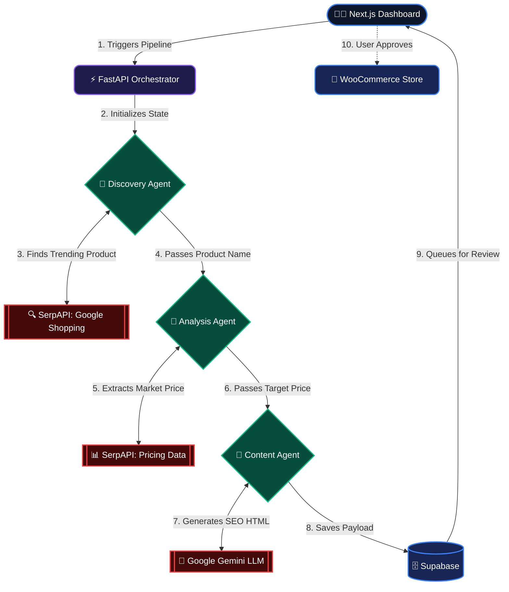

<div align="center">
  
  <h1>🌐 SynapseCommerce AI</h1>
  <p><strong>Autonomous Human-in-the-Loop E-Commerce Orchestration Platform</strong></p>

  <p>
    <a href="#-core-features">Features</a> •
    <a href="#-multi-agent-architecture">Architecture</a> •
    <a href="#️-tech-stack">Tech Stack</a> •
    <a href="#-local-setup--installation">Installation</a>
  </p>

  <p align="center">
    
    
    
    
    
  </p>
</div>

---

## 🚀 Overview

**SynapseCommerce AI** is a cutting-edge, autonomous pipeline designed to revolutionize affiliate marketing and e-commerce. It utilizes a multi-agent AI architecture to dynamically discover trending global products, analyze competitor pricing, generate SEO-optimized sales content, and queue them for human approval before autonomously publishing them to a live WooCommerce storefront.

Built with a **Zero-Fallback, Real-Data-Only** strict policy, the system ensures that every product, price, and description is pulled from live market data across 9 global regions.

## ✨ Core Features

*   🌍 **Dynamic Global Market Pivoting**: Select from 9 Tier-1/Tier-2 countries (US, UK, DE, JP, etc.) via the UI to discover natively trending products in that specific region.
*   🤖 **Multi-Agent Orchestration**: A sequential AI pipeline comprising specialized agents for Discovery, Market Analysis, and Content Generation.
*   🛡️ **Bulletproof Discovery**: Uses the SerpAPI ecosystem to bypass bot-protections and extract real-time top-selling gadgets directly from Google Shopping.
*   💰 **Intelligent Price Analysis**: Scrapes real competitor pricing and automatically calculates a highly competitive suggested price (default 5% undercut).
*   ✍️ **Generative SEO Content**: Leverages Google's **Gemini 2.5 Flash** models to write highly persuasive, HTML-structured, SEO-optimized product descriptions.
*   👨‍💻 **Human-in-the-Loop Dashboard**: A sleek, dark-mode Next.js control panel where operators can review AI-generated product proposals before they go live.
*   🛒 **WooCommerce Auto-Publishing**: One-click approval instantly formats and pushes the product directly to a live WordPress/WooCommerce store via REST API.

---

## 🧠 Multi-Agent Architecture

The brain of SynapseCommerce is built on a shared `AgentState` dictionary that passes context through a sequential pipeline of highly specialized Python agents.



### 1. Discovery Agent
Scans the selected global region using the SerpAPI Google Shopping engine. It dynamically rotates generic search queries (e.g., "best selling tech gadgets") to find a real, live product title. **(Zero-Fallback Policy enforced)**.

### 2. Analysis Agent
Takes the discovered product and cross-references it against live Google Shopping competitor prices in the targeted country. It aggregates the data and suggests an optimal retail price.

### 3. Content Agent
Utilizes **Google GenAI (Gemini)** to act as an expert affiliate marketer. It absorbs the product name and target price, outputting a fully structured HTML description focused on psychological sales benefits and SEO indexing. Includes intelligent rate-limit handling (35s backoff).

---

## 🛠️ Tech Stack

**Frontend (Dashboard)**
*   Framework: Next.js 14 (App Router)
*   Styling: Tailwind CSS (Glassmorphism, Dark Mode)
*   State & Auth: Supabase Client

**Backend (AI Orchestration)**
*   Framework: FastAPI (Python 3)
*   Search Engine API: SerpAPI (Google Shopping Engine)
*   LLM Integration: Google GenAI (`gemini-2.5-flash`)
*   Database: Supabase (PostgreSQL)

**E-Commerce Integration**
*   Platform: LocalWP / WordPress
*   Plugin: WooCommerce REST API

---

## 💻 Local Setup & Installation

### Prerequisites
*   Node.js (v18+)
*   Python (3.10+)
*   LocalWP (running a WooCommerce instance)
*   Active API Keys for: **Supabase**, **Google AI Studio (Gemini)**, and **SerpAPI**.

### 1. Clone & Configure
Clone the repository and set up your environment variables.
```bash
git clone https://github.com/tayyabalitech/synapse-commerce-ai.git
cd synapse-commerce-ai
```

**Backend `.env`**
```env
SUPABASE_URL=your_supabase_url
SUPABASE_KEY=your_supabase_service_key
GEMINI_API_KEY=your_gemini_key
SERPAPI_API_KEY=your_serpapi_key
WOOCOMMERCE_URL=http://your-local-wp-site.local
WOOCOMMERCE_KEY=ck_your_consumer_key
WOOCOMMERCE_SECRET=cs_your_consumer_secret
```

**Frontend `frontend/.env.local`**
```env
NEXT_PUBLIC_SUPABASE_URL=your_supabase_url
NEXT_PUBLIC_SUPABASE_ANON_KEY=your_supabase_anon_key
NEXT_PUBLIC_BACKEND_URL=http://localhost:8000
```

### 2. Run the Pipeline
We have included a batch script to launch the entire stack simultaneously.

**Windows:**
```cmd
start_local.bat
```
*(This will activate the Python virtual environment, start the Uvicorn FastAPI server on port 8000, and launch the Next.js frontend on port 3000).*

### 3. Operate
1. Open `http://localhost:3000` in your browser.
2. Select your target market (e.g., "United Kingdom 🇬🇧") from the dropdown.
3. Click **Run AI Agent**.
4. Review the AI's proposal in the queue.
5. Click **Approve** to instantly deploy the product to your WooCommerce store.

---

## 👨‍💻 Author

**Tayyab Ali**
*   📧 Email: [tayyabalitechpro@gmail.com](mailto:tayyabalitechpro@gmail.com)
*   💼 LinkedIn: [tayyabalitech](https://www.linkedin.com/in/tayyabalitech/)
